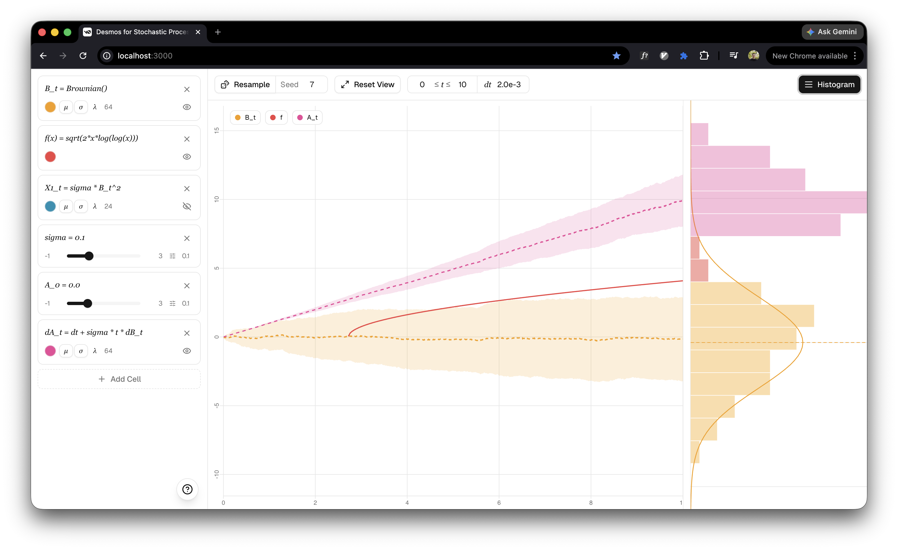

<div align="center">
  <h1>Stochastic Plotter</h1>
  <p>
    <strong>Desmos for Stochastic Processes.</strong><br />
    An interactive notebook for building, sampling, and comparing stochastic models in real time.
  </p>
  
  <p>
    Next.js 16 · React 19 · TypeScript · Zustand · Vitest
  </p>
</div>

## Overview

Stochastic Plotter is a notebook-style playground for stochastic calculus. You define constants, scalar functions, built-in processes, and derived processes in editable cells, then inspect sampled paths and endpoint distributions on a shared canvas.

The interaction model is intentionally close to Desmos: tweak a parameter, resample, drag the view, and see the plot update immediately.

## What It Can Do

- Define constants, scalar functions, stochastic processes, and derived processes in the same notebook
- Sample and compare multiple paths with deterministic seeds for reproducibility
- Visualize means, variance bands, and endpoint histograms with analytic density overlays when available
- Express Itô-style dynamics with `X_0 = ...` and `dX_t = ...`
- Build integrals, quadratic variation, covariation, and monotone time changes directly in notebook syntax
- Persist notebook state locally so experiments survive refreshes

## Notebook Language

The notebook supports a compact math-like syntax for common stochastic constructions:

```txt
mu = 0.12
sigma = 0.1
B_t = Brownian()
f(t) = sqrt(t * log(log(t)))
X_t = sigma * B_t^2
X_0 = 0
dA_t = dt + sigma * t * dB_t
```

Supported built-in processes:

- `Brownian()`
- `BrownianBridge(T)`
- `GeometricBrownian(mu, sigma, x0)`
- `OrnsteinUhlenbeck(theta, mu, sigma, x0)`
- `Poisson(lambda)`
- `RandomWalk(stepScale, dt)`

The runtime also supports:

- `integral(...)` for time and Itô integrals
- `qv(...)` for quadratic variation and covariation
- `B_t[f(t)]` and `B_{f(t)}` for monotone time changes

## Local Development

Install dependencies:

```bash
pnpm install
```

Start the development server:

```bash
pnpm dev
```

Open [http://localhost:3000](http://localhost:3000).

## Validation

```bash
pnpm lint
pnpm test
pnpm build
```

## Stack

- Next.js App Router for the application shell
- Zustand for notebook and viewport state
- A custom parser and evaluator for notebook expressions
- Canvas-based plotting for paths and endpoint distributions
- Vitest for runtime and plotting logic
